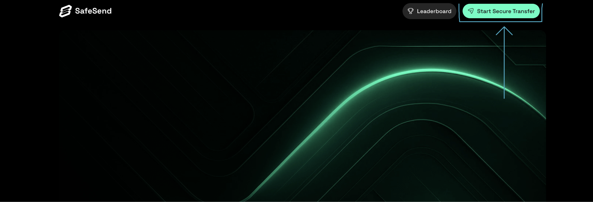

## Quickstart

SafeSend is a Web3 application designed to reduce the risk of sending tokens to the wrong address. Blockchain transactions are irreversible, and a single mistake when copying or pasting a wallet address can result in permanent loss of funds. SafeSend helps prevent this by introducing additional verification and confirmation steps before a transfer is executed on-chain.

SafeSend is useful for anyone who sends tokens manually, including individual users, teams, and organizations that want an extra layer of assurance when transferring assets across supported blockchain networks.

This quickstart guide shows you how to use the SafeSend user interface to complete your first secure token transfer. You will connect a wallet, enter transfer details, confirm the transaction, and view the final on-chain result.

If you want to understand the concepts behind SafeSend and why each verification step exists, see [How SafeSend Works](./1-how-safesend-works.md).  
For a guided, step-by-step walkthrough with more context, see [Tutorial: First SafeSend Transfer](../2-tutorials/0-first-safesend-transfer.md).

### Prerequisites

This guide assumes that:

- You have a supported Web3 wallet installed, such as MetaMask or WalletConnect
- You have tokens available on a supported blockchain network
- You have access to Telegram, which is required for transfer confirmation
- You are familiar with basic wallet interactions such as signing messages and approving transactions

For a complete list of supported wallets and networks, see the [Reference](../3-reference).

---

#### Step 1: Launch SafeSend

1. Go to https://safesend.to
2. Click **Start Secure Transfer** at the top of the page

    

#### Step 2: Connect Your Wallet

1. Click **Connect Wallet**
2. Select your wallet provider from the list
3. Approve the connection request in your wallet

SafeSend does not store private keys. All wallet approvals and signatures occur locally within your wallet provider.

#### Step 3: Connect Telegram

SafeSend uses Telegram as an external confirmation channel to prevent accidental or unauthorized transfers.

1. Go to the **Profile** section
2. Click **Connect Telegram**
3. Follow the prompts to link your Telegram account

Telegram is required to confirm transfers before they are executed on-chain.

#### Step 4: Verify Wallet Ownership

After connecting your wallet, SafeSend asks you to verify ownership of the address.

1. Click **Verify Wallet**
2. Sign the verification message when prompted

This step confirms that you control the connected wallet address before any transfer can be initiated.

#### Step 5: Enter Transfer Details
In the SafeSend inteface, you have input fields that collects the information for the transactions you want to carry out.
1. Select the blockchain network
2. Choose the token you want to send
3. Enter the main transfer amount
4. Enter a test amount (optional but recommended)
5. Enter the recipient wallet address

Carefully review the recipient address. Transactions submitted to the blockchain cannot be reversed.

#### Step 6: Approve the Transfer

SafeSend requests approval for the exact amount being transferred.

1. Review the transaction details
2. Approve the token transfer in your wallet

This approval limits the transaction to the specified amount and helps prevent unintended transfers.

#### Step 7: Confirm via Telegram

Before execution, SafeSend requires an external confirmation step.

1. Review the transaction details sent to Telegram
2. Confirm the transfer when prompted

The transaction will not be executed without this confirmation.

#### Step 8: View Transfer Status

After confirmation:

- SafeSend submits the transaction on-chain
- The transfer status updates in real time
- A transaction hash and block explorer link are provided once the transaction is confirmed

You can review completed transfers in **Transaction History**.

### Next Steps

- Learn more about SafeSend’s verification model: [How SafeSend Works](./1-how-safesend-works.md)
- Perform common tasks: [How-to Guides](../1-how-to)
- Complete a guided walkthrough: [Tutorial: First SafeSend Transfer](../2-tutorials/0-first-safesend-transfer.md)

### Notes

- Always verify recipient addresses before confirming a transfer
- SafeSend cannot recover funds sent to incorrect addresses
- Network fees apply to all on-chain transactions
