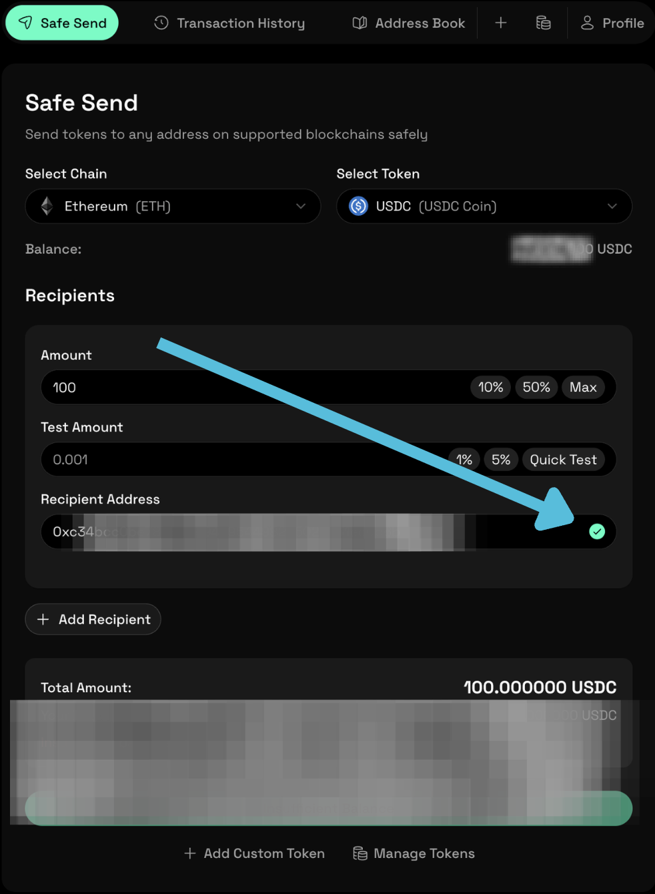

## Verify a Recipient Address

This guide explains how to verify a recipient wallet address before sending tokens with SafeSend. Verifying the recipient helps reduce the risk of sending funds to the wrong address, which cannot be reversed on-chain.

Use this guide when you are preparing a transfer and want to confirm that the recipient address is correct.

Before you begin, make sure that:

- Your wallet is connected and verified
- Telegram is connected to your SafeSend profile
- You have the recipient’s wallet address available

If you have not completed setup, see the [Quickstart](docs/0-get-started/0-quickstart.md).

### Verify a Recipient Address

1. Open the **Safe Send** page in the SafeSend dashboard.
2. Select the blockchain network for the transfer.
3. Choose the token you intend to send.
4. Paste the recipient wallet address into the **Recipient Address** field.
5. Review the detected address details shown by SafeSend.

6. (Optional) Enter a test amount to validate the transfer path.
7. Confirm the recipient details before continuing to approval.

SafeSend uses this information to prepare the transfer and present the details for confirmation.

### Confirm the Recipient via Telegram

Before the transfer can be executed, SafeSend sends a confirmation request through Telegram.

1. Review the recipient address and transfer details shown in Telegram.
2. Confirm the details if they are correct.

The transfer will not proceed unless the recipient details are confirmed.

### What to Check Before Confirming

Before approving the transfer, verify the following:

- The recipient address matches the intended destination
- The selected network is correct
- The token symbol and amount are correct

If any detail is incorrect, do not confirm the transfer. Return to SafeSend and update the information.

### Result

Once confirmed, the recipient address is locked for the current transfer and cannot be changed without restarting the process.

You can now proceed to approve and execute the transfer.

### Related Guides

- [Send Tokens Using SafeSend](1-send-tokens.md)
- [Quickstart](docs/0-get-started/0-quickstart.md)

