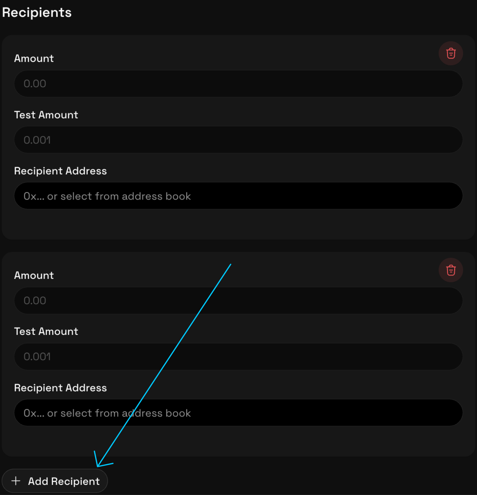

## Send Tokens Using SafeSend

This guide explains how to send tokens using SafeSend after your wallet, Telegram, and recipient details are set up. Use this guide when you are ready to execute a transfer and want to ensure it completes successfully.

For first-time setup or a full walkthrough, see the [Quickstart](../0-get-started/0-quickstart.md).

Before you begin, confirm that:

- Your wallet is connected and verified
- Telegram is connected to your SafeSend profile
- The recipient address has been verified
- You have sufficient token balance and network fees available

If any of these steps are incomplete, review the [Verify a Recipient Address](./0-verify-recipient.md) guide.

### Send Tokens

1. Open the **Safe Send** page in the SafeSend dashboard.
2. Select the blockchain network for the transfer.
3. Choose the token you want to send.
4. Enter the transfer amount.
5. (Optional) Enter a test amount.
6. Enter the recipient wallet address.
7. (Optional) To send to multiple recipients, click **Add Recipient** and repeat steps 4 to 6 for each additional recipient.

9. Review the transfer summary displayed by SafeSend.

   > SafeSend calculates the total amount across recipients and handles the distribution as part of the transfer flow.

10. Click **Send to [number] Recipient(s)**.

At this stage, SafeSend prepares the transaction but does not execute it on-chain.

### Approve the Token Transfer

SafeSend requests approval for the exact transfer amount.

1. Review the approval request in your wallet.
2. Confirm the approval.

This approval limits token access to the specified amount and does not authorize additional transfers.

### Confirm the Transfer via Telegram

Before execution, SafeSend sends a confirmation request through Telegram.

1. Review the transaction details, including:
   - Network
   - Token
   - Recipient address
   - Transfer amount
2. Confirm the transfer if all details are correct.

The transaction will not be executed without this confirmation.

### Monitor Transfer Status

After confirmation:

- SafeSend submits the transaction to the blockchain
- The transfer status updates in real time
- A transaction hash and block explorer link are provided once confirmed

You can view completed and pending transfers in **Transaction History**.

### If Something Looks Wrong

If you notice an incorrect detail before confirming in Telegram:

- Do not confirm the transfer
- Return to the SafeSend interface
- Update the transfer details or restart the process

Once confirmed and executed on-chain, transfers cannot be reversed.

### Result

After the transaction is confirmed on-chain, the tokens are delivered to the recipient address.

SafeSend records the transfer details for future reference and auditing.

### Related Guides

- [Verify a Recipient Address](./0-verify-recipient.md)
- [Quickstart](../0-get-started/0-quickstart.md)
