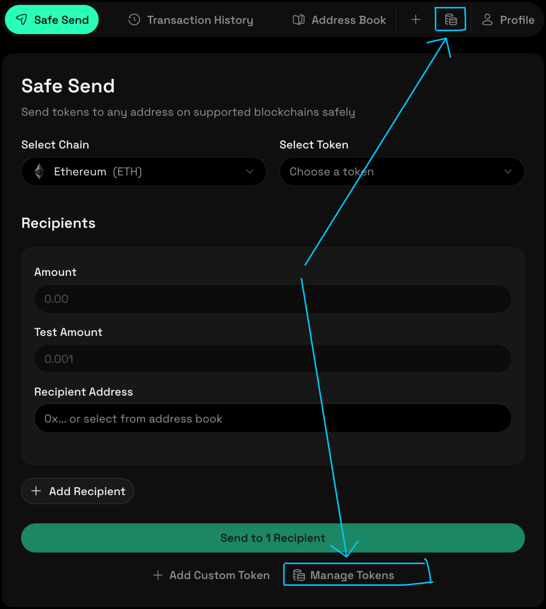

## Manage Custom Tokens

This guide explains how to manage custom tokens that you have added to SafeSend. You can review existing custom tokens or remove tokens that you no longer need.

Use this guide when you want to clean up your token list or adjust which tokens are available for transfers.

Before you begin, make sure that:

- Your wallet is connected and verified
- You are connected to the correct blockchain network
- At least one custom token has already been added

If you have not added a custom token yet, see [Add Custom Token](./2-add-custom-tokens.md).

### Go to Token Management

1. Open the **Safe Send** page in the SafeSend dashboard.
2. Click **Manage Tokens** below the token selection area.

The **Token Management** panel opens and displays all custom tokens currently available.

### Review Custom Tokens

In the Token Management panel, each custom token displays:

- Token name and symbol
- Contract address (shortened)
- Associated network

Use this information to confirm that each token matches the expected contract and network.

## Remove a Custom Token

If you no longer need a custom token:

1. Locate the token in the Token Management list.
2. Click **Remove**.
3. Confirm the removal when prompted.

The token is removed from your available token list and will no longer appear in the token selector.

Removing a token does not affect your wallet balance or any on-chain assets.

### Important Notes

- Removing a custom token does not revoke approvals or reverse transactions.
- Tokens can be re-added at any time using their contract address.
- SafeSend does not validate the legitimacy of custom token contracts.

Always verify token contract addresses before adding or removing tokens.

### Related Guides

- [Add Custom Token](./2-add-custom-tokens.md)
- [Send Tokens Using SafeSend](./1-send-tokens.md)
- [How SafeSend Works](../0-get-started/1-how-safesend-works.md)
