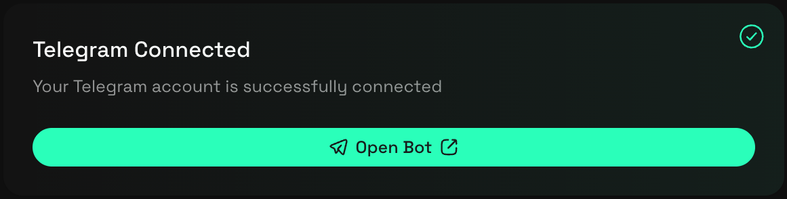

## Tutorial: Your First SafeSend Transfer

This tutorial walks you through completing your first secure token transfer using SafeSend. It is designed for new users who want a guided, end-to-end experience and additional context at each stage of the process.

By the end of this tutorial, you will have successfully completed a token transfer using SafeSend’s verification, approval, and confirmation flow.

### What You’ll Learn

In this tutorial, you will learn how to:

- Connect and verify a Web3 wallet
- Connect Telegram for external confirmation
- Configure a token transfer
- Confirm and execute a transfer safely
- View the final transaction on-chain

### Prerequisites

Before starting, make sure you have:

- A supported Web3 wallet installed and funded
- Active Telegram account
- A recipient wallet address for testing
- Tokens available on a supported network

If you prefer a faster setup without explanations, see the [Quickstart](../0-get-started/0-quickstart.md).

#### Step 1: Open SafeSend

1. Go to https://safesend.to
2. Click **Start Secure Transfer**

This opens the SafeSend dashboard, where transfers are configured and monitored.

#### Step 2: Connect Your Wallet

1. Click **Connect Wallet**
2. Select your wallet provider
3. Approve the connection request in your wallet

SafeSend does not store private keys. All wallet interactions happen locally within your wallet provider.

#### Step 3: Verify Wallet Ownership

After connecting your wallet and Telegram:

1. Click **Verify Wallet**
2. Sign the verification message in your wallet

This step confirms that you control the connected wallet address.

#### Step 4: Connect Telegram

SafeSend uses Telegram as an external confirmation channel.

1. Open the **Profile** section
2. Click **Connect Telegram**
3. Follow the prompts to link your Telegram account

You must connect Telegram before a transfer can be executed. If that you've connected your Telegram correctly, you should have a profile page like this:

#### Step 5: Configure the Transfer

1. Open the **Safe Send** page
2. Select the blockchain network
3. Choose the token you want to send
4. Enter a transfer amount
5. (Optional) Enter a test amount
6. Enter the recipient wallet address

At this stage, no funds have moved. You are only configuring the transfer.

#### Step 6: Review and Approve

1. Review the transfer summary displayed by SafeSend
2. Click **Send to 1 Recipient**
3. Approve the exact transfer amount in your wallet

SafeSend requests approval only for the specified amount.

#### Step 7: Confirm via Telegram

Before execution, SafeSend sends a confirmation request to Telegram.

1. Review the transfer details
2. Confirm the transaction if everything is correct

The transfer will not execute without this confirmation.

#### Step 8: Monitor the Transfer

After confirmation:

- SafeSend submits the transaction on-chain
- The status updates in real time
- A transaction hash and block explorer link are provided

You can track completed transfers in **Transaction History**.

### What Happens Next

Once the transaction is confirmed on-chain:

- Tokens are delivered to the recipient address
- The transfer is permanently recorded on the blockchain
- SafeSend stores the transfer details for reference

### Next Steps

Now that you’ve completed your first transfer, you can:

- Send to multiple recipients using **Add Recipient**
- Add and manage custom tokens
- Review past transfers in **Transaction History**
- Learn more about SafeSend’s security model in [How SafeSend Works](../0-get-started/1-how-safesend-works.md)

### Summary

In this tutorial, you completed a full SafeSend transfer using wallet verification, scoped approvals, and external confirmation. These steps work together to reduce the risk of irreversible transfer mistakes while keeping you in full control of your assets.
