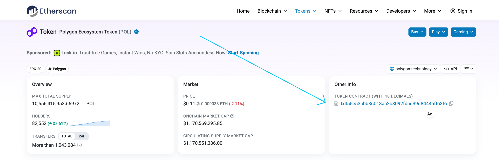
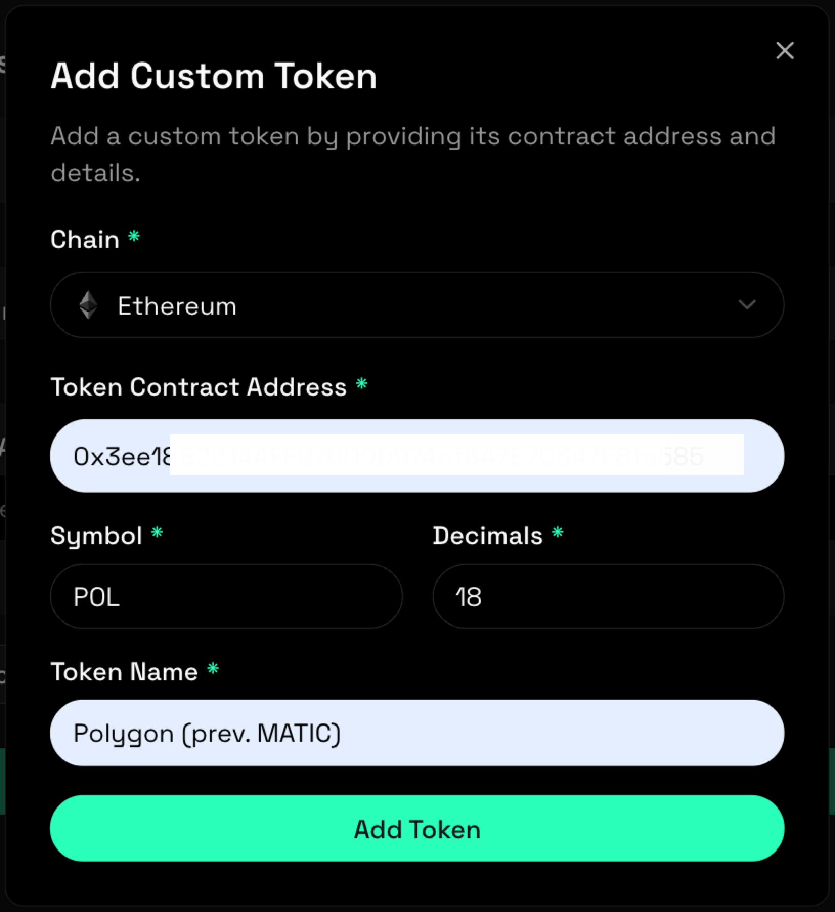
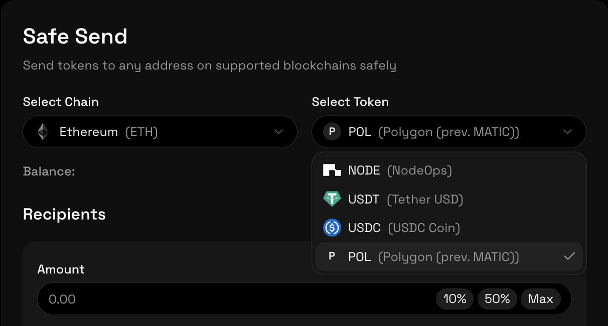
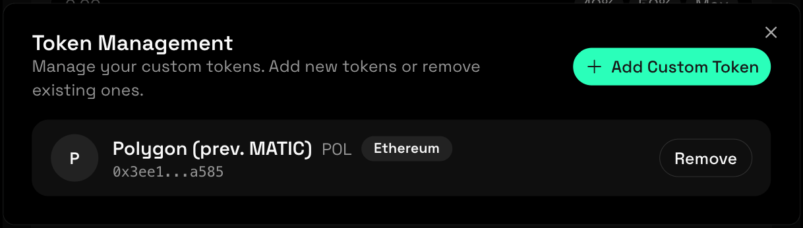

## Tutorial: Use a Custom Token with SafeSend

This tutorial walks you through adding a custom token to SafeSend, using it in a transfer, and then removing it from Token Management.

In this example, you will use the Polygon (POL) token to demonstrate the full lifecycle of a custom token inside SafeSend.

By the end of this tutorial, you will understand how to safely work with tokens that are not included in the default token list.

### What You’ll Learn

In this tutorial, you will learn how to:

- Add a custom token using a contract address
- Verify token details before using it
- Send a custom token with SafeSend
- Remove a custom token when it is no longer needed

### Prerequisites

Before starting, make sure you have:

- A connected and verified Web3 wallet
- Telegram connected to your SafeSend profile
- A balance of the Polygon (POL) token in your wallet
- Network fees available for the transfer

If you have not completed a transfer before, review the [First SafeSend Transfer tutorial](./0-first-safesend-transfer.md).

#### Step 1: Locate the Token Contract

To add a custom token, you need its contract address.

For this tutorial, use the Polygon (POL) token contract available on [Etherscan](https://etherscan.io/token/0x455e53cbb86018ac2b8092fdcd39d8444affc3f6):

Always confirm token contract addresses from a trusted block explorer before adding them.

#### Step 2: Add the Custom Token

1. Open the **Safe Send** page in the SafeSend dashboard.
2. Click **Add Custom Token** below the token selection area.
3. Select the chain you want to add the token to.
4. Paste the Polygon (POL) contract address.
5. Review the token details displayed by SafeSend, including:
   - Token name
   - Symbol
   - Decimals
   - Network
6. Click "Add Token".
   

Once added, Polygon (POL) appears in the token selection list.

#### Step 3: Send the Custom Token

1. Confirm that the selected network matches the token’s network.
2. Open the token selection dropdown.
3. Select the token from the dropdown, in this case **Polygon (POL)**.
   
5. Enter the transfer amount.
6. (Optional) Enter a test amount.
7. Enter the recipient wallet address.
8. Review the transfer summary.
9. Click **Send to 1 Recipient**.
10. Approve the transfer amount in your wallet.
11. Confirm the transaction via Telegram.

SafeSend submits the transaction on-chain after confirmation.

#### Step 5: Verify the Transfer

After execution:

- Monitor the transaction status in real time
- Open the transaction hash in a block explorer
- Confirm that the Polygon (POL) tokens were delivered to the recipient

The transfer also appears in **Transaction History**.

#### Step 6: Remove the Custom Token

Once you have completed the transfer, you can remove the custom token.

1. Open **Manage Tokens** from the Safe Send page.
2. Locate **Polygon (POL)** in the Token Management list.
    
3. Click **Remove**.
4. Confirm the removal.

The token is removed from your token list but remains fully intact in your wallet.

### Important Notes

- Removing a custom token does not affect wallet balances.
- Tokens can be re-added at any time using the same contract address.
- SafeSend does not validate token legitimacy beyond basic metadata.

Always verify contract addresses before adding or using custom tokens.

### Summary

In this tutorial, you added a custom token, used it in a secure transfer, and removed it from SafeSend once it was no longer needed. This workflow allows you to safely handle new or project-specific tokens without permanently cluttering your token list.
